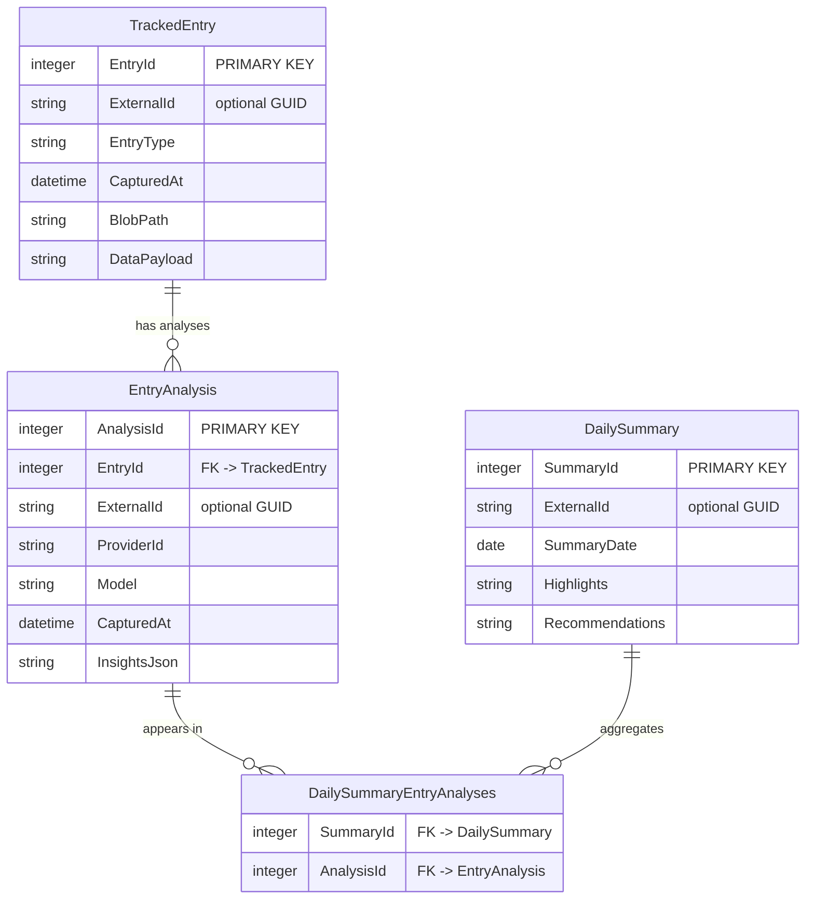
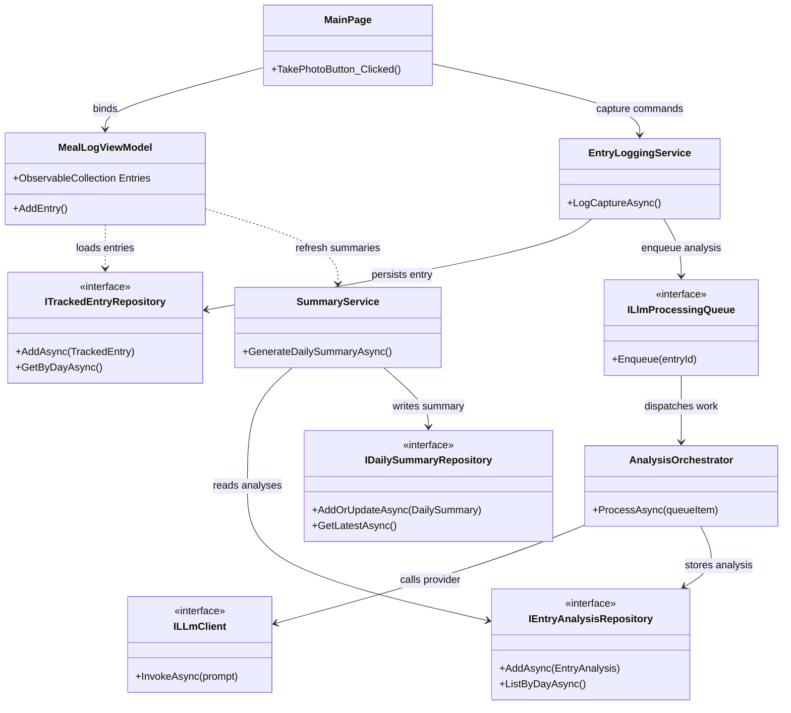

# HealthHelper Architecture

## Capture-to-Insight Flow

## Purpose & Scope
HealthHelper is a cross-platform .NET MAUI app that captures wellbeing signals (meals today, exercise and sleep tomorrow), enriches them with user-selected LLM insights, and surfaces daily summaries. This doc outlines system layers, data flow, and extensibility points so enhancements preserve the capture → analysis → summary pipeline.

## Layered Application Structure
- **UI Layer**: `Pages/` houses XAML views and `PageModels/` supplies presentation logic (e.g., `MainPage` + `MealLogViewModel`). Each page binds to observable collections of tracked entries so the UI reacts instantly to repository updates.
- **Domain Models**: `Models/` defines immutable records. We evolve toward a shared `TrackedEntry` root (`long Id`, `string? ExternalId`, `EntryType`, `CapturedAt`, `IEntryPayload Payload`) with type-specific payloads (`MealPayload`, `ExercisePayload`, `SleepPayload`) implementing `IEntryPayload`. Persist payloads as JSON via repository serializers so the schema remains versioned and strongly typed. Analysis entities (`EntryAnalysis`, `DailySummary`) live here as well.
- **Services & Utilities**: Capture orchestration, storage adapters, and LLM provider clients belong under `Utilities/` or a dedicated `Services/` folder and are registered centrally in `MauiProgram.cs` for dependency injection.
- **Platform Bridges**: `Platforms/` contains manifests and platform glue. Android currently uses `FileProvider` for captured photos; future heads may surface fitness sensors or sleep APIs.

## Entry Ingestion & Persistence Flow
1. **Capture / Import** – UI components invoke media pickers, sensor APIs, or manual forms to create `TrackedEntry` instances (current implementation handles photos via `MediaPicker`).
2. **Normalize** – Copy raw assets into app-owned folders (`FileSystem.AppDataDirectory/Entries/<EntryType>/`) and generate canonical metadata (timestamps, tags, origin) before persistence.
3. **Catalog** – Save entries through `ITrackedEntryRepository`, serialising the strongly typed `IEntryPayload` into JSON (including schema versioning) before persisting to SQLite. Columns include an auto-increment `EntryId`, optional `ExternalId` (GUID for sync), `EntryType`, `CapturedAt`, `PayloadJson`, `DataSchemaVersion`, `BlobPath`, and optional annotations. Repositories handle deserialisation back to the correct payload type when queried.
4. **Cleanup** – When entries are removed, repositories delete associated blobs. Add retention policies or archival hooks as the dataset grows.

## LLM Processing Pipeline
- **Trigger**: Persisted entries enqueue work items via `ILlmProcessingQueue`, encapsulating entry IDs and target models to centralise retries, batching, and cancellation.
- **Provider Abstraction**: `ILLmClient` defines a uniform contract. Provider adapters (OpenAI, Azure OpenAI, LiteLLM proxy, self-hosted endpoints) implement it, backed by user-selected settings stored in `SecureStorage` or encrypted preferences.
- **Prompt Construction**: Build prompts from entry metadata and down-sampled assets. Include entry type context so generic models interpret inputs correctly.
- **Invocation & Resilience**: Execute network calls via the chosen adapter, handling rate limits and translating provider-specific faults into domain errors. Processing happens off-device per the user’s trusted endpoint.
- **Storage**: Persist results as `EntryAnalysis` records keyed by an auto-incrementing integer `Id`. Each record stores `EntryId` (foreign key to `TrackedEntry`), `EntryType`, `ProviderId`, `Model`, `CapturedAt`, `InsightsJson`, `Confidence`, and optional `ExternalId` / `RawResponseHash` values for cross-device or integrity needs. Guard raw payload logging behind compile-time flags.

## Daily Summaries
- **Aggregation**: Group analyses by local calendar day, spanning all entry types. A summarisation service assembles prompts referencing the day’s `EntryAnalysis` records.
- **Persistence**: Store summaries in `DailySummary` rows (`Id`, `SummaryDate`, `EntryTypesCovered`, `Highlights`, `Recommendations`, `ProviderId`) keyed by an integer primary key with an optional external GUID for sync. Maintain a junction table (`DailySummaryEntryAnalyses`) capturing the association between a summary `Id` and the `AnalysisId` values it references so relationships stay normalised.
- **Presentation**: Bind summaries to dashboard cards or dedicated pages using `ObservableCollection<DailySummary>` for live updates.

## Data Access Strategy
- Commit to SQLite from the outset so structs stay queryable, transactional, and consistent. Choose either `sqlite-net-pcl` for lightweight mapping or `EntityFrameworkCore.Sqlite` for richer ORM features; both operate well on mobile targets.
- Repository interfaces under `Data/`:
  - `ITrackedEntryRepository` manages polymorphic entry metadata and associated blobs, persisting each entry with an `INTEGER PRIMARY KEY`, optional external GUID for sync, and JSON payload columns.
  - `IEntryAnalysisRepository` handles LLM outputs keyed by integer IDs with foreign keys to entries (and optional external GUIDs when required).
  - `IDailySummaryRepository` materialises summaries and their linked analyses (via the junction table) using integer keys for core relations.
  - `IProviderSettingsRepository` persists provider configuration and credentials.
- Repositories should map domain models to DTOs internally, leveraging SQLite's implicit `rowid` via `INTEGER PRIMARY KEY` columns for performance while versioning payload schemas to avoid drift. Resolve repositories through DI scopes so each user interaction receives a shared `DbContext`/connection, enabling atomic transactions across multiple repositories.
- Coordinating services (e.g., `EntryLoggingService`, `AnalysisOrchestrator`, `SummaryService`) encapsulate workflows so UI code remains thin.

## Extensibility & Future Work
- **Additional Entry Types**: Standardise payload schemas so new categories (biometrics, mood) integrate by defining value objects and UI flows while reusing repositories.
- **Imports & Integrations**: Support gallery imports, HealthKit/Google Fit bridges, or CSV ingestion that route through the same normalisation pipeline.
- **Provider Catalog**: Maintain a configurable provider registry (JSON or embedded configuration) enumerating endpoints, default models, and supported capabilities.
- **Sync & Backup**: Reserve `HealthHelper.Sync` for optional cloud backups; ensure serialised data redacts sensitive information.
- **Testing**: Build `HealthHelper.Tests/` with mocks for repositories, media adapters, and `ILLmClient` to validate orchestration and relational integrity without external calls.

## Operational Considerations
- Keep `ApplicationId` in `HealthHelper.csproj` aligned with manifest package identifiers to avoid deployment failures.
- Document keystore management, IDE “Distribute” signing steps, and publish commands so Release artifacts remain reproducible.
- Provide storage management UX (delete entries, re-run analyses with new providers) and signal when summaries are recomputed after provider changes.
- Manage SQLite connections through dependency injection scopes: register a single `HealthHelperDbContext` (or SQLite connection factory) in `MauiProgram` and resolve repositories per scope so they share the same unit of work during a user action. This pattern avoids `database is locked` errors by letting the platform coordinate transactions.
